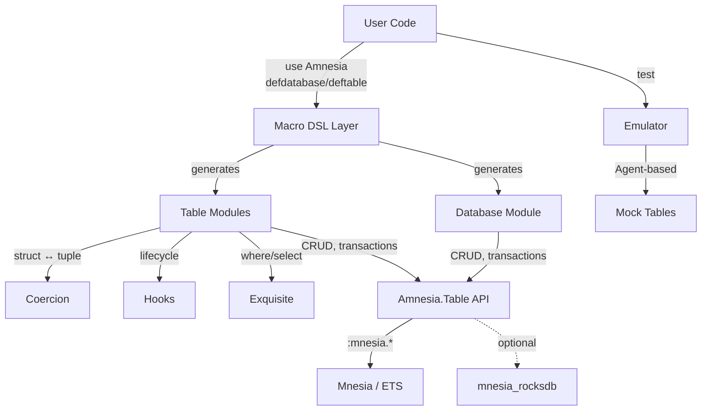

# Project Architecture

## Overview

Amnesia (`:nuamnesia`) is a macro-based Elixir DSL that wraps Erlang's Mnesia distributed database. It provides `defdatabase` and `deftable` macros that generate full Elixir modules backed by structs, translating Elixir-friendly options into native Mnesia calls. An in-process emulator layer allows testing without a running Mnesia instance.

## System Diagram

## Core Components

| Component | Purpose |
|-----------|---------|
| `Amnesia` | Entry point — `defdatabase` macro, transaction helpers, start/stop |
| `Amnesia.Database` | `deftable` macro, database create/destroy/wait lifecycle |
| `Amnesia.Table` | Low-level Mnesia CRUD, locking, copying, indexing |
| `Amnesia.Table.Definition` | Code generation — turns `deftable` into a full module with struct |
| `Amnesia.Hooks` | Overridable lifecycle callbacks (write, read) on table records |
| `Amnesia.Access` | Behaviour for custom `mnesia:activity` access modules |
| `Amnesia.Emulator` | Agent-based Mnesia mock for testing |
| `Amnesia.Schema` | Mnesia schema create/destroy on nodes |

## Macro DSL

The `defdatabase`/`deftable` macros are the primary API. `deftable` generates a module with a struct, CRUD functions, query macros (`where`/`where!`), hooks, streaming, and automatic coercion between Elixir structs and Mnesia tuples.

-> *See [arch/macro-dsl.md](arch/macro-dsl.md) for details*

## Transaction Model

Amnesia exposes five execution contexts that map to Mnesia's activity modes: `transaction`, `transaction!` (sync), `async` (dirty async), `sync` (dirty sync), and `ets`. Functions suffixed with `!` use dirty operations (no transaction). The `Amnesia.Access` behaviour allows plugging custom access modules via `mnesia:activity`.

-> *See [arch/transactions.md](arch/transactions.md) for details*

## Storage Backends

Tables support `:memory` (RAM), `:disk` (disc_copies), `:disk!` (disc_only_copies), and optionally `:rock!` (RocksDB via `mnesia_rocksdb`). RocksDB support is auto-detected at compile time.

## Query System

The `where` macro integrates with the Exquisite library (`nexquisite` dep) to compile Elixir expressions into Mnesia match_specs at compile time. Lower-level `select`, `match`, and `match!` functions are also available.

## Emulator

The emulator provides an Agent-backed in-memory mock of Mnesia tables for testing. It tracks table state, records, and call history without requiring a real Mnesia instance.

-> *See [arch/emulator.md](arch/emulator.md) for details*

## Technology Stack

| Layer | Technology |
|-------|------------|
| Language | Elixir 1.19+ / Erlang/OTP 28 |
| Database | Mnesia (built-in), optional mnesia_rocksdb |
| Query DSL | Exquisite (via `nexquisite` dep) |
| Testing | ExUnit, Mock |
| Docs | ExDoc |

## Key Decisions

- **Macro-generated modules**: Each table becomes its own module with a struct, enabling pattern matching and custom functions on records
- **Elixir-friendly naming**: Mnesia's Erlang conventions are mapped to idiomatic Elixir (`:disc_copies` -> `:disk`, `:sticky_write` -> `:write!`)
- **`!` suffix convention**: `write!`/`read!`/`select!` use dirty (non-transactional) operations; `transaction!` means synchronous transaction
- **Autoincrement via metadata**: Counter-based autoincrement stored in a per-database metadata table
